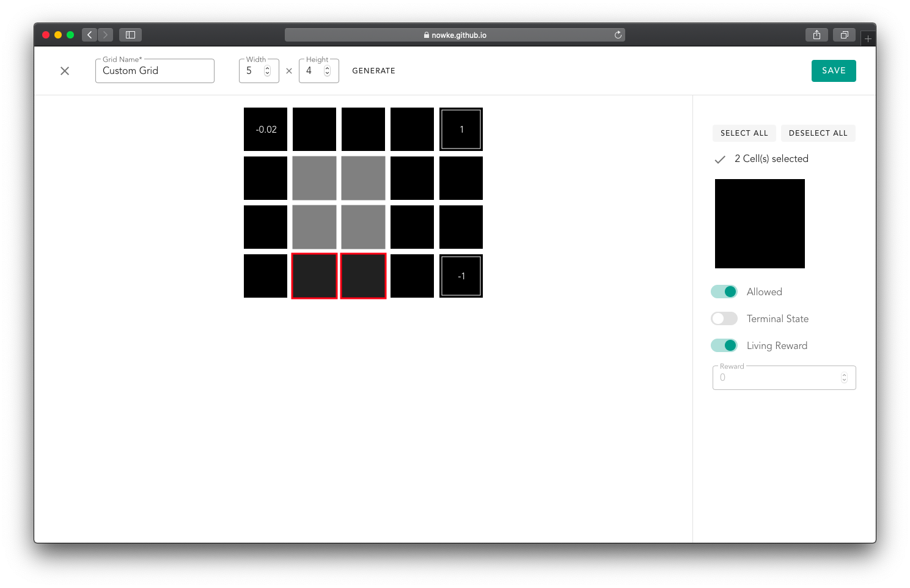

# GridWorld RL

Value Iteration, Policy Iteration for GridWorld, with a feature to build custom grids. Inspired from [UC Berkeley CSE188 - Reinforcement Learning Project](http://ai.berkeley.edu/reinforcement.html)

**Try it out**: [https://nowke.github.io/rlviz/](https://nowke.github.io/rlviz/)




## Project setup
```
yarn install
```

### Compiles and hot-reloads for development
```
yarn serve
```

### Compiles and minifies for production
```
yarn build
```

### Lints and fixes files
```
yarn lint
```
